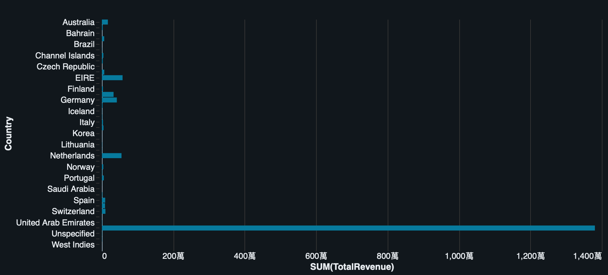
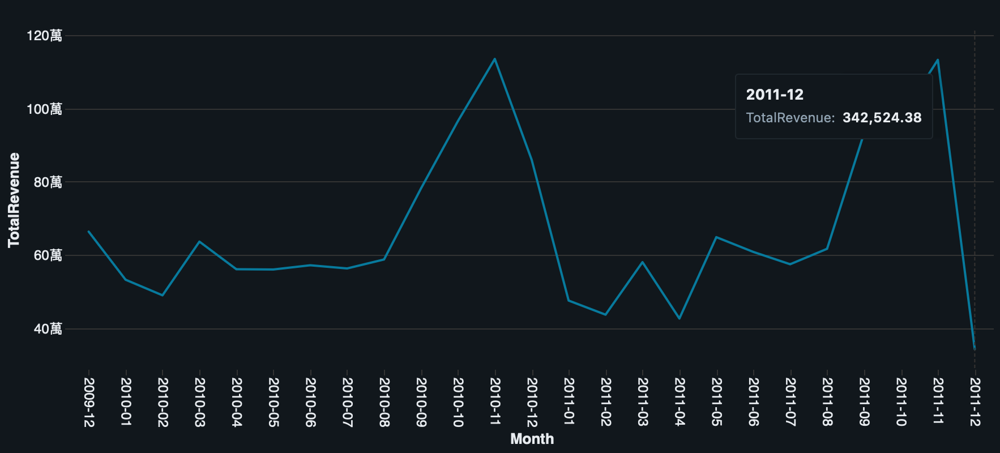
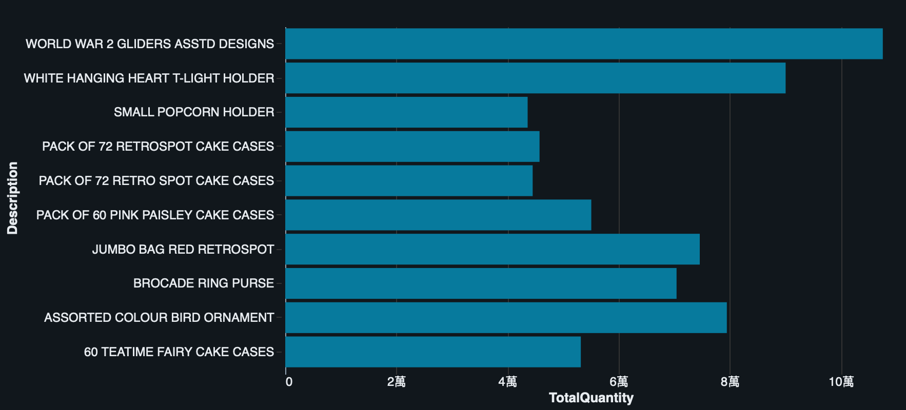

# Retail Data Lakehouse

Retail sales analysis project built with Databricks and PySpark.

## Project Overview

This project analyzes retail transaction data using PySpark on Databricks.

The analysis includes:

- Data Cleaning
- Customer KPI Analysis
- Product KPI Analysis
- Sales Dashboard

## Tech Stack

- Databricks
- Apache Spark (PySpark)
- Python
- Git
- GitHub

## Project Structure

```
notebooks/
├── 01_ingest_data.ipynb
├── 02_customer_kpi.ipynb
├── 03_product_kpi.ipynb
└── 04_sales_dashboard.ipynb

images/
```

## Dashboard

### Revenue by Country



---

### Monthly Revenue Trend



---

### Top 10 Products by Revenue



## Key Insights

- United Kingdom generated the highest revenue.
- Sales peaked during the holiday season.
- A small number of products contributed a large portion of revenue.
- High-value customers generated significant sales.
